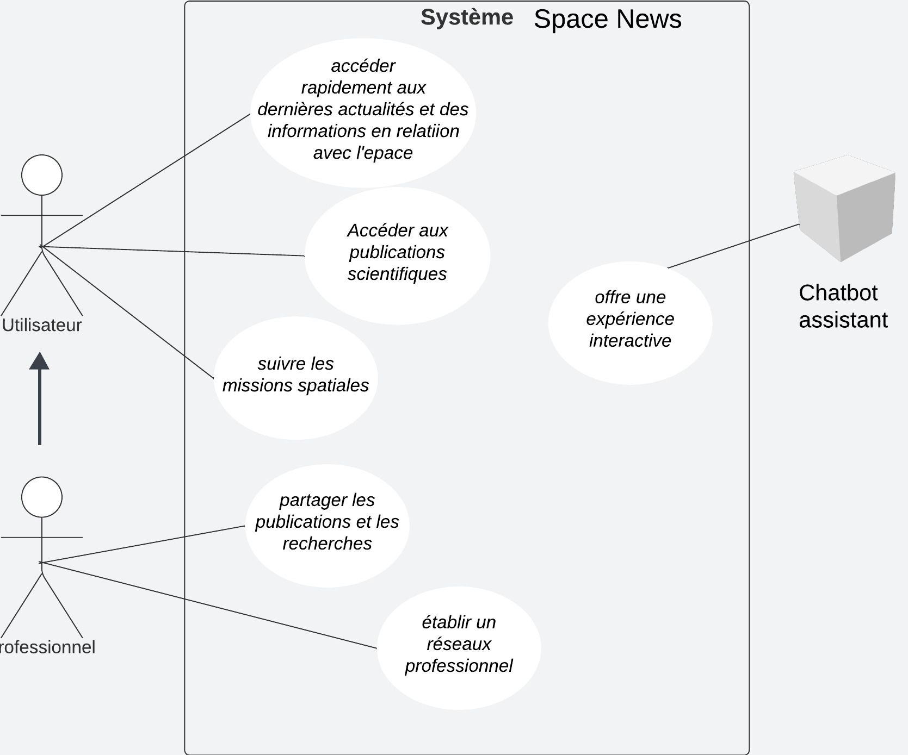
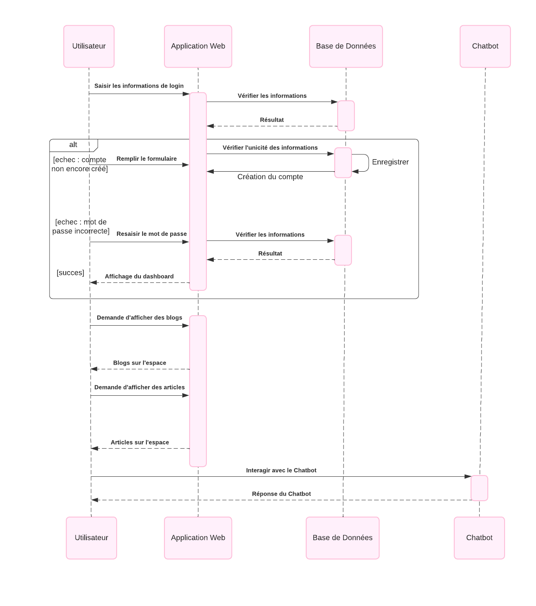
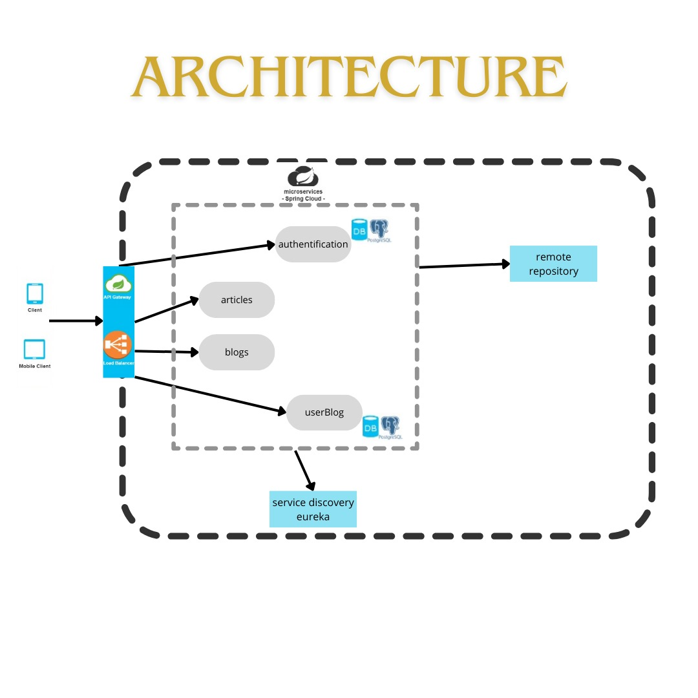

# Space News Application

## Overview

Space News Application is a modern platform that provides the latest news and articles about space. Based on a microservices architecture and integrating a chatbot assistant, this application offers a rich and interactive user experience for astronomy and space exploration enthusiasts.

## Table of Contents

- [1. Description](#description)
- [2. Diagrams](#diagrams)
- [3. Setting Up Microservices](#microservices)
- [4. Project Architecture](#project-architecture)
- [5. Communication between microservices using api gateway](#api-gateway)
- [6. Discovery Service (Eureka)](#discovery-service-eureka)
- [7. Containerizing microservices using Docker](#containerizing-microservices-using-docker)
  - [1. Docker — Overview](#1-docker--overview)
  - [2. Set Up](#2-set-up)
- [8. Deploy microservices to local Kubernetes](#deploy-microservices-to-local-kubernetes)
- [9. deploy microservices to EKS cluster using git actions](#deploy-microservices-to-EKS-cluster-using-git-actions)
- [10. Installation](#installation)
- [11. Usage](#usage)
- [12. CI/CD Pipeline for Microservices Project](#CI/CD-Pipeline-for-Microservices-Project)
- [13 .Technologies Used](#technologies-used)
- [14. Contributors](#contributors)
- [15. License](#license)

## Description

The Space News application stands out for its modular and scalable design, allowing efficient feature management and easy extensibility. Leveraging modern technologies such as Spring Boot, Spring Cloud, PostgreSQL, and Docker, the application delivers optimal performance and simplified maintenance.

## Diagrams
Use Case

Sequence Diagram


## Microservices
### 1. Login Service
- **Description:** This service handles user registration, login, and management.
- **Features:**
    - Registration of a new user with information such as name, email, and password.
    - User authentication during login.

### 2. Articles Service
- **Description:** This service manages the of articles related to space.
- **Features:**
    - Display daily articles for users sourced from the Spaceflight API.
    - 
### 3. Blogs Service
- **Description:** This service manages the of blogs related to space.
- **Features:**
    - Display daily blogs for users sourced from the Spaceflight API.

### 4. UserBlog Service
- **Description** This service offers a platform for users to share blogs and ideas with others.
- **Features:**
    - Users can publish their own blogs on space-related topics.
    - Viewing blogs published by other users.
    - deleting their own blogs.

## Communication between microservices using API Gateway (Spring Cloud Gateway)
After creating all microservices, we utilize an API Gateway which is Spring Cloud Gateway to manage and route HTTP requests between them. It provides various features such as request routing, CORS management, resilience, security, and rate limiting.

- Configure the API Gateway to route requests to the appropriate microservices.
- Use the API Gateway's URL in your service class to send requests to other microservices.
- Call the microservice via the API Gateway.
  
**Basic Configuration**

To configure Spring Cloud Gateway in a Spring Boot project, you need to add the necessary dependencies and define routes in the application.yml file.

**Maven Dependencies**

Add the following dependencies to your pom.xml file:

    ```xml
 <dependency>
    <groupId>org.springframework.cloud</groupId>
    <artifactId>spring-cloud-starter-gateway</artifactId>
 </dependency>

## Eureka (Discovery Service)

Spring Cloud Eureka is a discovery service that allows applications to find and communicate with each other without needing to know their exact locations. This is particularly useful in a microservices architecture where service instances can dynamically change due to scaling, deployment, or failures.

### How it Works

1. *Service Registration*:
    - Microservices register with the Eureka server using Eureka clients. Each service sends periodic heartbeats to renew its registration.
2. *Service Discovery*:
    - Microservices can query Eureka to get the list of available service instances. This allows resolving a service name to a specific IP address and port.
3. *Fault Tolerance*:
    - In case of a service instance failure, Eureka automatically removes that instance from its list after several unsuccessful heartbeat attempts.


### How do I get set up?

In order to transform a common Spring Boot application into an Eureka Server, only three steps are needed:

- Add Spring Cloud dependency:

```bash
<dependency>
    <groupId>org.springframework.cloud</groupId>
    <artifactId>spring-cloud-starter-netflix-eureka-server</artifactId>
</dependency>
- Enable Eureka initialization during Spring Boot startup using the annotation @EnableEurekaServer on the main class:

```bash
@SpringBootApplication
@EnableEurekaServer
public class EurekaServerApplication {
    public static void main(String[] args) {
        SpringApplication.run(EurekaServerApplication.class, args);
    }
}
```

- Add some configuration :

_application.yml_

```bash
spring:
  application:
    name: discovery

eureka:
  instance:
    hostname: discovery
  client:
    register-with-eureka: false
    fetch-registry: false
    service-url:
      defaultZone: http://discovery:8761/eureka/
server:
  port: 8761
```

- Enable eureka in microservices

```bash
@SpringBootApplication
@EnableEurekaClient
public class ExampleMicroserviceApplication {
    public static void main(String[] args) {
        SpringApplication.run(ExampleMicroserviceApplication.class, args);
    }
}
```
 ## Project Architecture

The application is designed using a microservices architecture. The different microservices communicate with each other via an API Gateway (Spring Cloud Gateway) and are registered in the Eureka discovery service.



## Installation

### Prerequisites

- Java 17
- Maven 3.8+
- Docker (optional for running services in containers)

### Installation Steps

1. **Clone the repository:**
   ```sh
   git clone https://github.com/your-username/space-news-app.git
   cd space-news-app
2. **Build the microservices:**
   ```sh
   mvn clean install
3. **Start Eureka (Discovery Service):**
   ```sh
   cd eureka-service
   mvn spring-boot:run
 
4. **Start the microservices**
   ```sh
   cd article-feed-service
   mvn spring-boot:run
   cd ../blog-cr-service
   mvn spring-boot:run
   cd ../discovery-service
   mvn spring-boot:run
   cd ../frontend-service
   mvn spring-boot:run
   cd ../login-service
   mvn spring-boot:run
   cd ../api-gateway
   mvn spring-boot:run

## Containerizing microservices using Docker

### 1. Docker — Overview

Docker is a **containerization technology** that allows developers to package an application along with all its dependencies into a container. These containers are lightweight, portable, and can run on any platform that supports Docker. A docker container simplifies the process of building, shipping, and running applications, making it easier to manage and scale them.

#### Four Major Components of Docker

- **Container:** A container is a standalone executable package that includes an application and all its dependencies.

- **Image:** An image is a read-only template that defines the contents and configuration of a container.

- **Docker Engine:** The Docker Engine is the core component responsible for building, running, and managing containers.

- **Registry:** Docker images can be stored and shared in registries, which act as centralized repositories.
  ### 2. Set Up
5. **Alternatively, you can use Docker Compose to start all services:**

   ```sh
   docker-compose up --build
# CI/CD Pipeline for Microservices Project

This project uses a CI/CD pipeline to automate the build, test, and deployment processes for a microservices architecture using Spring Boot. The pipeline leverages GitHub Actions, Docker, and Amazon EKS for continuous integration and continuous deployment.

## Prerequisites

- Docker Hub account
- AWS account with EKS cluster named `spacenews` in the `eu-north-1` region
- GitHub repository with the necessary secrets configured

## CI/CD Pipeline

The CI/CD pipeline is defined in `.github/workflows/ci-cd-pipeline.yml` and consists of two jobs: `build-and-push` and `deploy`.

### build-and-push Job

This job runs on every push to the `main` branch and performs the following steps:

1. **Checkout code**: Retrieves the latest code from the repository.
2. **Set up JDK 17**: Configures the Java Development Kit version 17 using AdoptOpenJDK.
3. **Set execute permission for Maven Wrapper**: Ensures the Maven Wrapper script is executable.
4. **Build Docker images for services**: Uses Maven and Jib to build Docker images for each microservice.
5. **List Docker images**: Lists the Docker images created.
6. **Log in to Docker Hub**: Logs in to Docker Hub using the provided credentials.
7. **Push Docker images to Docker Hub**: Pushes the Docker images to Docker Hub.

### deploy Job

This job runs after the `build-and-push` job and performs the following steps:

1. **Checkout code**: Retrieves the latest code from the repository.
2. **Configure AWS credentials**: Sets up AWS credentials for accessing EKS.
3. **Update kubeconfig for Amazon EKS**: Updates the kubeconfig file to interact with the EKS cluster.
4. **Deploy to Amazon EKS**: Applies the Kubernetes deployment YAML files to the EKS cluster.

## GitHub Secrets

The following GitHub secrets are configured for the pipeline to work:

- `DOCKER_HUB_USERNAME`: Your Docker Hub username.
- `DOCKER_HUB_ACCESS_TOKEN`: Your Docker Hub access token.
- `AWS_ACCESS_KEY_ID`: Your AWS access key ID.
- `AWS_SECRET_ACCESS_KEY`: Your AWS secret access key.

## Docker Images

The Docker images for the microservices are built using Maven and Jib, and are tagged with the `latest` tag. These images are pushed to Docker Hub and are used in the Kubernetes deployment.

## Kubernetes Deployment

The Kubernetes deployment files are located in the `k8s` directory. These files define the deployment and service configurations for each microservice, as well as the PostgreSQL database and frontend.

To manually deploy the services to your EKS cluster, you can use the following command:

```sh
kubectl apply -f k8s/

### Technologies Used
1. **Backend:**
- Spring Boot
- Spring Cloud Gateway
- Spring Security
- Spring Data JPA
- Database:
- PostgreSQL
2. **Frontend:**
- HTML
- CSS
- Bootstrap
- Chatbot:
- SAP Conversational AI
- Discovery Service:
- Eureka

## Unit Tests

Some microservices of the Space News application have undergone unit testing to ensure their correct operation and robustness. Unit tests are an essential practice to identify and correct potential bugs, as well as to ensure code quality. The following microservices have been tested:

- **Login Service:** Unit tests have been written to verify the proper functioning of user registration, login, and management features.
- **Articles Service:** Unit tests have been performed to ensure that CRUD (Create, Read, Update, Delete) operations on articles work correctly. These tests cover scenarios such as adding new articles, retrieving existing articles, updating article information, and deleting articles from the database.
- **Community Service:** Unit tests have been conducted to validate the functionality related to publishing, viewing, and managing blogs. These tests verify that users can publish their own blogs, view blogs authored by others, and perform actions such as editing and deleting their own blogs.


## Contributors
- EL ADES Salma - @SAMAME2003
- FAJOUI Basma - @FAJOUIBasma
- MOUL EL KHAYL Fatima zahra - @fatimamlk


