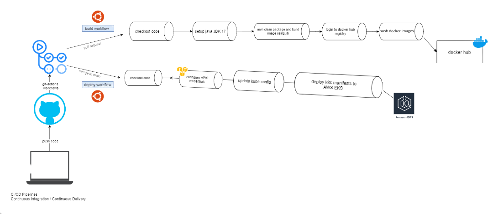

 # Space News Application

## Overview

Space News Application is a modern platform that provides the latest news and articles about space. Based on a microservices architecture and integrating a chatbot assistant, this application offers a rich and interactive user experience for astronomy and space exploration enthusiasts.

## Table of Contents

- [1. Project Description](#1-project-description)
- [2. Technologies Used](#2-technologies-used)
- [3. UML Diagrams](#3-uml-diagrams)
- [4. Microservices](#4-microservices)
- [5. Communication Between Microservices](#5-communication-between-microservices)
- [6. Discovery Service (Eureka)](#6-discovery-service-eureka)
- [7. Project Architecture](#7-project-architecture)
- [8. Installation](#8-installation)
- [9. Containerizing Microservices Using Docker](#9-containerizing-microservices-using-docker)
  - [1. Docker — Overview](#docker--overview)
  - [2. Set Up](#set-up)
- [10. Deploy Microservices to Local Kubernetes](#10-deploy-microservices-to-local-kubernetes)
- [11. CI/CD Pipeline](#11-CI/CD-Pipeline)
  - [1. GitHub Secrets](#github-secrets)
  - [2. Docker Images](#docker-images)
  - [3. Kubernetes Deployment](#kubernetes-deployment)
- [12. Deploy Microservices to EKS Cluster Using GitHub Actions](#12-deploy-microservices-to-eks-cluster-using-github-actions)
- [13. Deployment Workflow Diagram](#13-deployment-workflow-diagram)
- [14. Contributors](#14-contributors)
- [15. License](#15-license)

## 1. Project Description

The Space News application excels with its modular and scalable design, enabling efficient feature management and easy extensibility. It utilizes modern technologies like Spring Boot, Spring Cloud, PostgreSQL, and Docker, ensuring optimal performance and simplified maintenance. With a microservices architecture, the application enhances scalability and maintainability. The backend is developed using Spring Boot, while the frontend employs HTML, CSS, and JavaScript.

## 2. Technologies Used

### Backend:
- Spring Boot
- Spring Cloud Gateway
- Spring Security
- Spring Data JPA
- **Database**:
  - PostgreSQL

### Frontend:
- HTML
- CSS
- Bootstrap
- **Chatbot**:
  - SAP Conversational AI
- **Discovery Service**:
  - Eureka

## 3. UML Diagrams
- **Use Case**
  
- **Sequence Diagram**
  

## 4. Microservices

### 1. Login Service
- **Description:** This service handles user registration, login, and management.
- **Features:**
  - Registration of a new user with information such as name, email, and password.
  - User authentication during login.

### 2. Articles Service
- **Description:** This service manages articles related to space.
- **Features:**
  - Display daily articles for users sourced from the Spaceflight API.

### 3. Blogs Service
- **Description:** This service manages blogs related to space.
- **Features:**
  - Display daily blogs for users sourced from the Spaceflight API.

### 4. UserBlog Service
- **Description:** This service offers a platform for users to share blogs and ideas with others.
- **Features:**
  - Users can publish their own blogs on space-related topics.
  - View blogs published by other users.
  - Delete their own blogs.

## 5. Communication Between Microservices
Spring Cloud Gateway serves as a single entry point for all client requests to backend microservices, providing features such as request routing, CORS management, resilience, security, and rate limiting.

### How it Works

1. **Routing**:
   - Uses routes to direct HTTP requests to appropriate services. Each route is defined with a set of predicates and filters.

2. **Predicates**:
   - Determine if a request matches a specific route, checking URL path, request headers, query parameters, etc.

3. **Filters**:
   - Modify the request or response, e.g., adding or removing headers, rewriting URL paths, redirecting requests, handling errors, and limiting the rate.

4. **Integration with Eureka**:
   - Enables routing requests to appropriate service instances without statically configuring service addresses.

### Advantages

- **Security**:
  - Centralizes security management to authenticate and authorize requests before they reach the microservices.

- **CORS Management**:
  - Facilitates Cross-Origin Request Sharing management by configuring global CORS rules.

- **Rate Limiting**:
  - Protects microservices from overloads by limiting the number of requests each client can make within a given period.

- **Observability**:
  - Collects metrics and logs on network traffic to monitor performance and diagnose issues.

### Setup
- Add Spring Cloud dependency:
  ```xml
  <dependency>
      <groupId>org.springframework.cloud</groupId>
      <artifactId>spring-cloud-starter-gateway</artifactId>
  </dependency>
 ```
```bash
@SpringBootApplication
public class ApiGatewayApplication {
    public static void main(String[] args) {
        SpringApplication.run(ApiGatewayApplication.class, args);
    }
}
```
- Add some configuration (application.properties) :
```bash
spring.application.name=api-gateway
eureka.client.serviceUrl.defaultZone=http://localhost:8763/eureka
app.eureka-server=localhost
server.port=9000
eureka.instance.prefer-ip-address=true


spring.cloud.gateway.discovery.locator.enabled=true

## articles Service Route
spring.cloud.gateway.routes[0].id= articles-feed-service
spring.cloud.gateway.routes[0].predicates[0]=Path=/articles/**
spring.cloud.gateway.routes[0].uri=lb://articles-feed-service

## articles Service Route
spring.cloud.gateway.routes[4].id= blog-cr-service
spring.cloud.gateway.routes[4].predicates[0]=Path=/blogCr/**
spring.cloud.gateway.routes[4].uri=lb://blog-cr-service


spring.cloud.gateway.routes[3].id=home-page
spring.cloud.gateway.routes[3].uri=file:///C:/Users/hp/SpaceNews/articles_feed_service/src/main/resources/templates/home.html
spring.cloud.gateway.routes[3].predicates[0]=Path=/home


## blogs Service Route
spring.cloud.gateway.routes[1].id=spacenews
spring.cloud.gateway.routes[1].predicates[0]=Path=/blogs/**
spring.cloud.gateway.routes[1].uri=lb://spacenews


## login Service Route
spring.cloud.gateway.routes[2].id=login
spring.cloud.gateway.routes[2].predicates[0]=Path=/login/**
spring.cloud.gateway.routes[2].uri=lb://login
```


## 6. Discovery Service (Eureka)

Spring Cloud Eureka is a discovery service that allows applications to find and communicate with each other without needing to know their exact locations. This is particularly useful in a microservices architecture where service instances can dynamically change due to scaling, deployment, or failures.

### How it Works

1. *Service Registration*:
    - Microservices register with the Eureka server using Eureka clients. Each service sends periodic heartbeats to renew its registration.
2. *Service Discovery*:
    - Microservices can query Eureka to get the list of available service instances. This allows resolving a service name to a specific IP address and port.
3. *Fault Tolerance*:
    - In case of a service instance failure, Eureka automatically removes that instance from its list after several unsuccessful heartbeat attempts.


### How do I get set up?

In order to transform a common Spring Boot application into an Eureka Server, only three steps are needed:

- Add Spring Cloud dependency:

```bash
<dependency>
    <groupId>org.springframework.cloud</groupId>
    <artifactId>spring-cloud-starter-netflix-eureka-server</artifactId>
</dependency>
- Enable Eureka initialization during Spring Boot startup using the annotation @EnableEurekaServer on the main class:

```bash
@SpringBootApplication
@EnableEurekaServer
public class EurekaServerApplication {
    public static void main(String[] args) {
        SpringApplication.run(EurekaServerApplication.class, args);
    }
}
```

- Add some configuration :

_application.yml_

```bash
spring:
  application:
    name: discovery

eureka:
  instance:
    hostname: discovery
  client:
    register-with-eureka: false
    fetch-registry: false
    service-url:
      defaultZone: http://discovery:8761/eureka/
server:
  port: 8761
```

- Enable eureka in microservices

```bash
@SpringBootApplication
@EnableEurekaClient
public class ExampleMicroserviceApplication {
    public static void main(String[] args) {
        SpringApplication.run(ExampleMicroserviceApplication.class, args);
    }
}
```
 ## 7. Project Architecture

The application is designed using a microservices architecture. The different microservices communicate with each other via an API Gateway (Spring Cloud Gateway) and are registered in the Eureka discovery service.


## 8. Installation

### Prerequisites

- Java 17
- Maven 3.8+
- Docker (optional for running services in containers)

### Installation Steps

1. **Clone the repository:**
   ```sh
   git clone https://github.com/your-username/space-news-app.git
   cd space-news-app
2. **Build the microservices:**
   ```sh
   mvn clean install
3. **Start Eureka (Discovery Service):**
   ```sh
   cd eureka-service
   mvn spring-boot:run
 
4. **Start the microservices**
   ```sh
   cd article-feed-service
   mvn spring-boot:run
   cd ../blog-cr-service
   mvn spring-boot:run
   cd ../discovery-service
   mvn spring-boot:run
   cd ../frontend-service
   mvn spring-boot:run
   cd ../login-service
   mvn spring-boot:run
   cd ../api-gateway
   mvn spring-boot:run


## 9. Containerizing microservices using Docker

### 1. Docker — Overview

Docker is a **containerization technology** that allows developers to package an application along with all its dependencies into a container. These containers are lightweight, portable, and can run on any platform that supports Docker. A docker container simplifies the process of building, shipping, and running applications, making it easier to manage and scale them.

#### Four Major Components of Docker

- **Container:** A container is a standalone executable package that includes an application and all its dependencies.

- **Image:** An image is a read-only template that defines the contents and configuration of a container.

- **Docker Engine:** The Docker Engine is the core component responsible for building, running, and managing containers.

- **Registry:** Docker images can be stored and shared in registries, which act as centralized repositories.
  ### 2. Set Up
5. **Alternatively, you can use Docker Compose to start all services:**

   ```sh
   docker-compose up --build
## 10. Deploy microservices to local Kubernetes

### Step 1: Start Minikube

  ```sh
minikube start
eval $(minikube -p minikube docker-env)
cd articles-feed-service
docker build -t articles-feed-service:latest .
cd ../blogs-feed-service
docker build -t blogs-feed-service:latest .
cd ../userblog-service
docker build -t userblog-service:latest .
cd ../login-service
docker build -t login-service:latest .
cd ../apigateway
docker build -t apigateway:latest .
cd ../discovery-service
 ```
### Step 2:Deploy to Kubernetes
Apply the Kubernetes deployment and service YAML files for each microservice:

 ```sh
docker build -t discovery-service:latest .
kubectl apply -f kubernetes/articles-feed-service-deployment.yaml
kubectl apply -f kubernetes/articles-feed-service-service.yaml
kubectl apply -f kubernetes/blogs-feed-service-deployment.yaml
kubectl apply -f kubernetes/blogs-feed-service-service.yaml
kubectl apply -f kubernetes/login-service-deployment.yaml
kubectl apply -f kubernetes/login-service-service.yaml
kubectl apply -f kubernetes/apigateway-deployment.yaml
kubectl apply -f kubernetes/apigateway-service.yaml
kubectl apply -f kubernetes/discovery-service-deployment.yaml
kubectl apply -f kubernetes/discovery-service-service.yaml
 ```
 
## 11. CI/CD Pipeline for Microservices Project

This project uses a CI/CD pipeline to automate the build, test, and deployment processes for a microservices architecture using Spring Boot. The pipeline leverages GitHub Actions, Docker, and Amazon EKS for continuous integration and continuous deployment.

### Prerequisites

- Docker Hub account
- AWS account with EKS cluster named `spacenews` in the `eu-north-1` region
- GitHub repository with the necessary secrets configured

### CI/CD Pipeline

The CI/CD pipeline is defined in `.github/workflows/ci-cd-pipeline.yml` and consists of two jobs: `build-and-push` and `deploy`.

#### build-and-push Job

This job runs on every push to the `main` branch and performs the following steps:

1. **Checkout code**: Retrieves the latest code from the repository.
2. **Set up JDK 17**: Configures the Java Development Kit version 17 using AdoptOpenJDK.
3. **Set execute permission for Maven Wrapper**: Ensures the Maven Wrapper script is executable.
4. **Build Docker images for services**: Uses Maven and Jib to build Docker images for each microservice.
5. **List Docker images**: Lists the Docker images created.
6. **Log in to Docker Hub**: Logs in to Docker Hub using the provided credentials.
7. **Push Docker images to Docker Hub**: Pushes the Docker images to Docker Hub.

### deploy Job

This job runs after the `build-and-push` job and performs the following steps:

1. **Checkout code**: Retrieves the latest code from the repository.
2. **Configure AWS credentials**: Sets up AWS credentials for accessing EKS.
3. **Update kubeconfig for Amazon EKS**: Updates the kubeconfig file to interact with the EKS cluster.
4. **Deploy to Amazon EKS**: Applies the Kubernetes deployment YAML files to the EKS cluster.

### GitHub Secrets

The following GitHub secrets are configured for the pipeline to work:

- `DOCKER_HUB_USERNAME`: Your Docker Hub username.
- `DOCKER_HUB_ACCESS_TOKEN`: Your Docker Hub access token.
- `AWS_ACCESS_KEY_ID`: Your AWS access key ID.
- `AWS_SECRET_ACCESS_KEY`: Your AWS secret access key.

### Docker Images

The Docker images for the microservices are built using Maven and Jib, and are tagged with the `latest` tag. These images are pushed to Docker Hub and are used in the Kubernetes deployment.

### Kubernetes Deployment

The Kubernetes deployment files are located in the `k8s` directory. These files define the deployment and service configurations for each microservice, as well as the PostgreSQL database and frontend.

To manually deploy the services to your EKS cluster, you can use the following command:

```sh
kubectl apply -f k8s/
```


## 12. Deploy Microservices to EKS Cluster Using GitHub Actions

### Step 1: Create an EKS Cluster

1. **Log in to AWS Console:** Navigate to the AWS Management Console.
   
2. **Open Amazon EKS Console:** Go to the Amazon EKS service.
   
3. **Create Cluster:**
   - Click on "Create cluster".
   - Choose configuration (region, version, instance types).
   - Set cluster name as `spacenews`.

### Step 2: Set Up IAM Roles

1. **Create IAM Role for EKS Nodes:**
   - Navigate to IAM service.
   - Create IAM role for EKS worker nodes.
   - Attach necessary policies (e.g., AmazonEKSWorkerNodePolicy).

2. **Create IAM Role for Kubernetes Service Account:**
   - Create IAM role for Kubernetes service accounts if needed.
   - Attach policies for required permissions.

### Step 3: Configure `kubectl` for EKS Cluster

1. **Install `kubectl`:** Install `kubectl` CLI tool if not installed.

2. **Configure `kubectl`:**
   - Use AWS CLI to update `kubectl` configuration:
     ```bash
     aws eks --region <region-code> update-kubeconfig --name spacenews
     ```
   - Replace `<region-code>` with your AWS region.

### Step 4: Verify Cluster Setup

1. **Verify Cluster:**
   - Check cluster status:
     ```bash
     kubectl get clusters
     kubectl get nodes
     ```

2. **Deploy Applications:**
   - Proceed with deploying microservices to the EKS cluster.
## 13. Deployment workflow diagram



## 14. Contributors
- FAJOUI Basma - @FAJOUIBasma
- EL ADES Salma - @SAMAME2003
- MOUL EL KHAiL Fatima zahra - @fatimamlk


